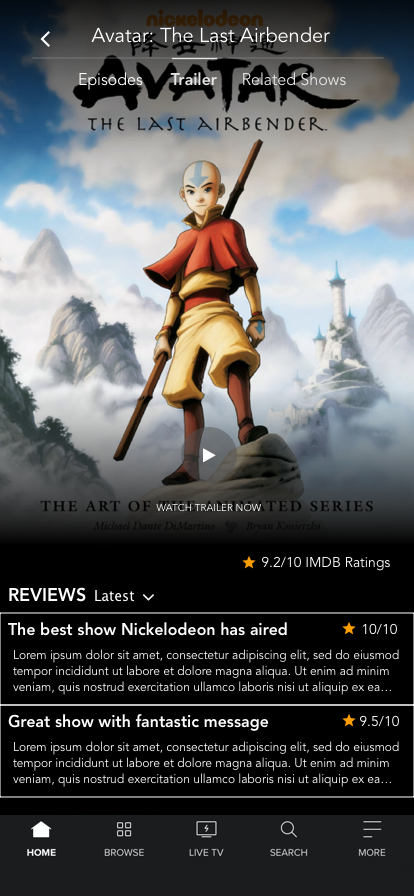

# CBS-Interactive-Designs
Some cool designs I thought up while using the CBS All Access app

# Overview & Thinking Behind Design
Recreated the CBS All Access Episode Screen with minor UI changes.
* Removed About section because the whole view only consist of description, it might not need a whole screen dedicated to it.
* Maybe add it to the Episode screen because it can give users a quick overview of the show the moment they select it (reducing needed swipe). This can be helpful for first time viewers of show.

Replaced "About" section with "Trailer" Section
* Reasoning behind this idea was that many times when I'm looking for a new show to binge, a trailer gives me a better sense of the quality of the show.
* Having a review section can also help increase engagement of the app. Everytime when I watch trailers on Youtube, I always check the comments for reactions.

These are just some ideas I had, let me know what you think. 

        

